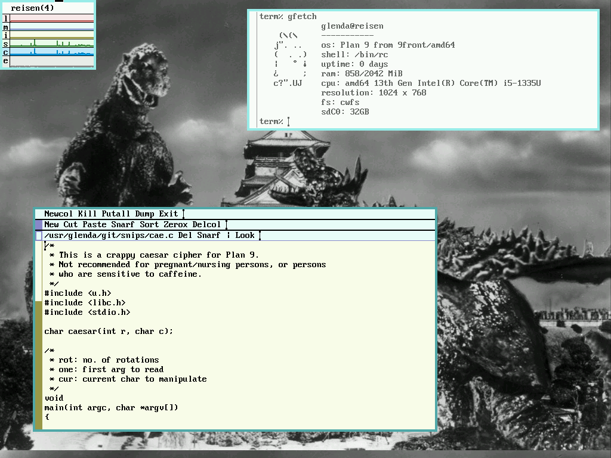

## Hi there 👋

- 🔭 I’m currently working on **college classes**
- 🌱 I’m currently learning **C and Go**
- 👯 I’m looking to collaborate on **anything!**
- 🤔 I’m looking for help with **everything :(**
- 💬 Ask me about **Plan 9**
- 📫 How to reach me: **@wiz:g24.at on matrix**
- 😄 Pronouns: **He/him**
- ⚡ Fun fact: **Chinese takeout boxes were first invented to carry oysters**

My avatar is the "Go" gopher, drawn by [Renee French](https://reneefrench.blogspot.com/) - <a rel="nofollow" class="external free" href="https://golang.org/doc/gopher/README">http://golang.org/doc/gopher/README</a>, <a href="https://creativecommons.org/licenses/by/3.0" title="Creative Commons Attribution 3.0">CC BY 3.0</a>

<!--
**kinggizzardandtheinstallationwizard/kinggizzardandtheinstallationwizard** is a ✨ _special_ ✨ repository because its `README.md` (this file) appears on your GitHub profile.

Here are some ideas to get you started:

- 🔭 I’m currently working on ...
- 🌱 I’m currently learning ...
- 👯 I’m looking to collaborate on ...
- 🤔 I’m looking for help with ...
- 💬 Ask me about ...
- 📫 How to reach me: ...
- 😄 Pronouns: ...
- ⚡ Fun fact: ...
-->
